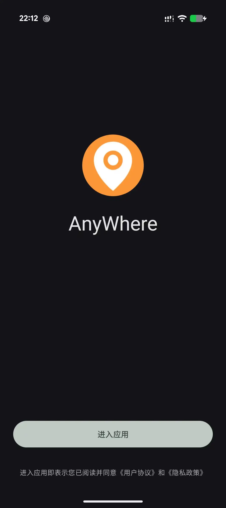
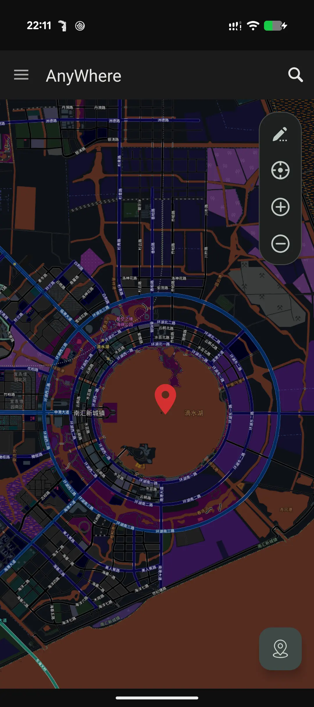
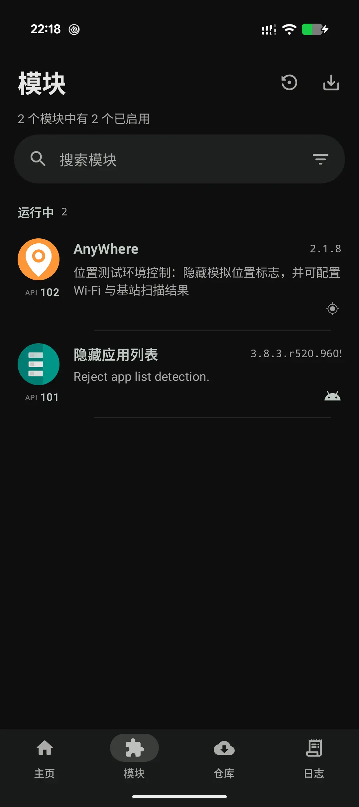

English | [简体中文](README.md)

# AnyWhere

AnyWhere is a location environment simulation tool for Android development debugging, functional testing, and personal research.

## Notice

The source code is now maintained in a private repository, and this repository will no longer sync subsequent source commits. Please download official releases only from the [Releases](https://github.com/cxOrz/AnyWhere/releases) page of this repository.

## Features

- Stationary and moving location simulation
- Enable the module in an LSPosed framework for the full feature set
- Explore more advanced features on your own...

## Preview

| Welcome screen | Map screen | LSPosed settings |
| :---: | :---: | :---: |
|  |  |  |

## Installation and Usage

1. Download the APK for your device architecture from [Releases](https://github.com/cxOrz/AnyWhere/releases);
2. In the system "Developer options", set AnyWhere as the mock location app;
3. In [Vector](https://github.com/JingMatrix/Vector) (or another LSPosed framework), enable this module and select the target apps you want to test; selecting system scopes such as "System framework" is not needed and is not recommended; (optional)
4. Launch the app and grant location permissions;
5. Pick a location on the map and start simulation.

## Project History

Earlier versions were built on [GoGoGo](https://github.com/cxOrz/GoGoGo).

The current private release has been refactored and no longer follows the architecture of the earlier project.

## Disclaimer

AnyWhere is intended only for software development debugging, functional testing, and personal learning and research. It must not be used for any behavior that violates laws and regulations, infringes on the rights of others, or violates third-party platform rules, including but not limited to fake attendance check-ins, game cheating, and online fraud.

It has been tested only on personal devices; consistent compatibility with all devices, Android versions, or third-party apps is not guaranteed.
Users are solely responsible for any account restrictions, service interruptions, data loss, or legal liability caused by improper use.

---

AnyWhere © 2026 cxOrz
